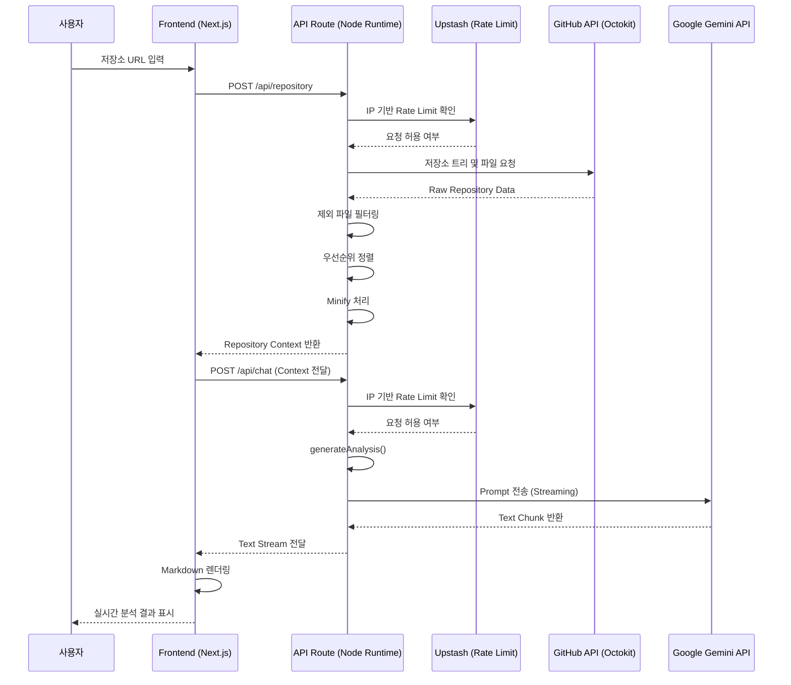

# Repo Map

GitHub API로 받은 저장소 데이터를 Gemini API를 이용해 분석하여 분석 결과를 보여주는 프로젝트

## 🚀 배포

[Repo Map](https://repo-map-rose.vercel.app/)

## ⚙️ 기술

### Frontend & Framework


### Styling & UI


### Data & State Management


### AI & API


### Markdown & Syntax Highlighting


### Testing


### Development Tools


## 📜 설계

<details>
<summary><strong>📃 시퀀스 다이어그램</strong></summary>



</details>

<details>
<summary><strong>📃 API 문서</strong></summary>

### ✅ Fetch Repository Context

GitHub 저장소의 파일 트리와 소스 코드를 수집하고  
AI 분석을 위한 컨텍스트 데이터를 반환합니다.

#### Request

- URL: `/api/repository`
- Method: `POST`
- Content-Type: `application/json`
- Auth Required: `No`
- Rate Limit: `Enabled`

**Request Body**

```json
{
  "owner": "jeong922",
  "repo": "Repo_Map",
  "branch": "main"
}
```

| 필드   | 타입   | 필수 | 설명                 |
| ------ | ------ | ---- | -------------------- |
| owner  | string | O    | GitHub 저장소 소유자 |
| repo   | string | O    | 저장소 이름          |
| branch | string | X    | 분석 대상 브랜치     |

#### Success Response

```json
{
  "success": true,
  "currentBranch": "main",
  "treeCount": 50,
  "fileContentCount": 7,
  "tree": [],
  "sourceContext": []
}
```

| 필드             | 설명                            |
| ---------------- | ------------------------------- |
| currentBranch    | 분석 대상 브랜치                |
| treeCount        | 반환된 파일 트리 개수 (최대 50) |
| fileContentCount | AI 분석 코드 개수 (최대 7)      |
| tree             | 필터링된 파일 트리              |
| sourceContext    | AI 분석용 코드 데이터           |

#### Processing Rules

저장소 데이터는 AI 비용과 응답 속도를 고려하여 전처리됩니다.

| 항목              | 제한           |
| ----------------- | -------------- |
| Tree 구조 반환    | 최대 50개      |
| Source 코드 수집  | 최대 10개      |
| 최종 AI 분석 파일 | 최대 7개       |
| Binary 파일       | 제외           |
| node_modules      | 제외           |
| build/dist        | 제외           |
| 코드 내용         | minify 후 전달 |

#### Error Response

```json
{
  "success": false,
  "error": "owner와 repo 파라미터가 누락되었습니다."
}
```

| Code | 설명                 |
| ---- | -------------------- |
| 400  | 잘못된 요청          |
| 403  | 허용되지 않은 Origin |
| 429  | 요청 제한 초과       |
| 500  | 서버 내부 오류       |

---

### ✅ Analyze Repository

수집된 저장소 데이터를 Gemini AI로 분석하고  
텍스트 스트리밍 형태로 결과를 반환합니다.

#### Request

- URL: `/api/chat`
- Method: `POST`
- Content-Type: `application/json`
- Auth Required: `No`
- Rate Limit: `Enabled`
- Response Type: `Stream`

**Request Body**

```json
{
  "prompt": "repository context data..."
}
```

| 필드   | 타입   | 필수 | 설명                |
| ------ | ------ | ---- | ------------------- |
| prompt | string | O    | AI 분석 요청 데이터 |

#### Response

응답은 `chunked streaming` 방식으로 순차 반환됩니다.

예시:

```text
프로젝트 구조를 분석한 결과:

1. 주요 기능
- 사용자 인증
- API 처리

2. 개선 사항
- ...
```

#### Error Response

```json
{
  "success": false,
  "error": "prompt 파라미터가 누락되었습니다."
}
```

| Code | 설명                           |
| ---- | ------------------------------ |
| 400  | 잘못된 JSON 또는 파라미터 누락 |
| 403  | 허용되지 않은 Origin           |
| 429  | 요청 제한 초과                 |
| 500  | 서버 내부 오류                 |

---

### System Constraints

- Origin 검증 적용
- IP 기반 Rate Limiting 적용
- AI 응답은 Streaming 방식 사용
- 대규모 저장소는 일부 파일만 분석
- 중요도가 높은 파일 우선 분석

</details>

## 🖥️ 화면 및 기능

## 🛠️ 성능 최적화 및 문제 해결
