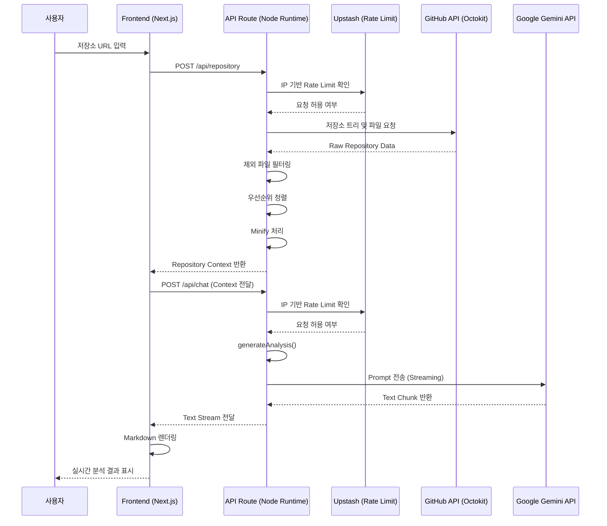

# Repo Map

GitHub API로 받은 저장소 데이터를 Gemini API를 이용해 분석하여 분석 결과를 보여주는 프로젝트

## 🚀 배포

### [Repo Map](https://repo-map-rose.vercel.app/)

## ▶️ 실행 방법

### 1. 패키지 설치

```bash
npm install
```

### 2. 환경 변수 설정

`.env.local`

```env
GEMINI_API_KEY=your_api_key
GITHUB_TOKEN=your_github_token

UPSTASH_REDIS_REST_URL=your_url
UPSTASH_REDIS_REST_TOKEN=your_token

NEXT_PUBLIC_APP_URL=http://localhost:3000
```

### 3. 개발 서버 실행

```bash
npm run dev
```

### 5. 브라우저 접속

```text
http://localhost:3000
```

## ⚙️ 기술

### Frontend & Framework


### Styling & UI


### Data & State Management


### AI & API


### Markdown & Syntax Highlighting


### Testing


## 📜 설계

### ⚙️ 기능 목록

<details>
<summary><strong>자세히 보기</strong></summary>

1. **초기 화면**
   - 사용자는 GitHub 저장소 URL을 입력할 수 있다.
   - 저장소 분석 시작 버튼을 클릭하면 분석이 시작된다.
   - 잘못된 GitHub 저장소 URL를 입력한 경우 안내 메세지를 보여준다.

2. **Repository 데이터 수집**
   - 입력된 GitHub 저장소 정보(owner, repo, branch)를 기반으로 데이터를 수집한다.
   - GitHub API를 통해 저장소 파일 트리 구조를 조회한다.
   - 분석 대상이 아닌 파일은 자동으로 제외한다.
     - Binary 파일
     - node_modules
     - build/dist 파일
   - 중요도가 높은 파일을 우선적으로 선택한다.
   - 파일 내용은 Minify 처리 후 AI 분석 컨텍스트로 전달된다.

3. **AI 저장소 분석**
   - 수집된 Repository Context를 기반으로 Gemini API 분석을 수행한다.
   - 분석 결과는 스트리밍 형태로 순차 출력된다.
   - 분석 내용 예시:
     - 기술 스택
     - 핵심 로직 및 아키텍처
     - 코드 품질 및 패턴 리뷰
     - 최적화 및 개선 제안

4. **실시간 응답 처리**
   - AI 응답은 Streaming 방식으로 수신한다.
   - 응답 완료 전에도 사용자에게 실시간으로 내용을 표시한다.
   - Markdown 형식 및 코드 하이라이팅을 지원한다.

5. **보안 및 요청 제한**
   - Origin 검증을 수행한다.
   - IP 기반 Rate Limit를 적용한다.
   - 허용되지 않은 요청은 차단한다.

6. **에러 처리**
   - 잘못된 Repository 정보 입력 시 에러를 표시한다.
   - API 요청 제한 초과 시 안내 메시지를 표시한다.
   - AI 응답 실패 시 재시도 메시지를 제공한다.

</details>

### 📃 시퀀스 다이어그램



### 📃 API 문서

<details>

<summary><strong>Fetch Repository Context</strong></summary>

### ✅ Fetch Repository Context

GitHub 저장소의 파일 트리와 소스 코드를 수집하고  
AI 분석을 위한 컨텍스트 데이터를 반환합니다.

#### Request

- URL: `/api/repository`
- Method: `POST`
- Content-Type: `application/json`
- Auth Required: `No`
- Rate Limit: `Enabled`

**Request Body**

```json
{
  "owner": "jeong922",
  "repo": "Repo_Map",
  "branch": "main"
}
```

| 필드   | 타입   | 필수 | 설명                 |
| ------ | ------ | ---- | -------------------- |
| owner  | string | O    | GitHub 저장소 소유자 |
| repo   | string | O    | 저장소 이름          |
| branch | string | X    | 분석 대상 브랜치     |

#### Success Response

```json
{
  "success": true,
  "currentBranch": "main",
  "treeCount": 50,
  "fileContentCount": 7,
  "tree": [],
  "sourceContext": []
}
```

| 필드             | 설명                            |
| ---------------- | ------------------------------- |
| currentBranch    | 분석 대상 브랜치                |
| treeCount        | 반환된 파일 트리 개수 (최대 50) |
| fileContentCount | AI 분석 코드 개수 (최대 7)      |
| tree             | 필터링된 파일 트리              |
| sourceContext    | AI 분석용 코드 데이터           |

#### Processing Rules

저장소 데이터는 AI 비용과 응답 속도를 고려하여 전처리됩니다.

| 항목              | 제한           |
| ----------------- | -------------- |
| Tree 구조 반환    | 최대 50개      |
| Source 코드 수집  | 최대 10개      |
| 최종 AI 분석 파일 | 최대 7개       |
| Binary 파일       | 제외           |
| node_modules      | 제외           |
| build/dist        | 제외           |
| 코드 내용         | minify 후 전달 |

#### Error Response

```json
{
  "success": false,
  "error": "owner와 repo 파라미터가 누락되었습니다."
}
```

| Code | 설명                 |
| ---- | -------------------- |
| 400  | 잘못된 요청          |
| 403  | 허용되지 않은 Origin |
| 429  | 요청 제한 초과       |
| 500  | 서버 내부 오류       |

</details>

<details>

<summary><strong>Analyze Repository</strong></summary>

### ✅ Analyze Repository

수집된 저장소 데이터를 Gemini AI로 분석하고  
텍스트 스트리밍 형태로 결과를 반환합니다.

#### Request

- URL: `/api/chat`
- Method: `POST`
- Content-Type: `application/json`
- Auth Required: `No`
- Rate Limit: `Enabled`
- Response Type: `Stream`

**Request Body**

```json
{
  "prompt": "repository context data..."
}
```

| 필드   | 타입   | 필수 | 설명                |
| ------ | ------ | ---- | ------------------- |
| prompt | string | O    | AI 분석 요청 데이터 |

#### Response

응답은 `chunked streaming` 방식으로 순차 반환됩니다.

예시:

```text
프로젝트 구조를 분석한 결과:

1. 주요 기능
- 사용자 인증
- API 처리

2. 개선 사항
- ...
```

#### Error Response

```json
{
  "success": false,
  "error": "prompt 파라미터가 누락되었습니다."
}
```

| Code | 설명                           |
| ---- | ------------------------------ |
| 400  | 잘못된 JSON 또는 파라미터 누락 |
| 403  | 허용되지 않은 Origin           |
| 429  | 요청 제한 초과                 |
| 500  | 서버 내부 오류                 |

---

### System Constraints

- Origin 검증 적용
- IP 기반 Rate Limiting 적용
- AI 응답은 Streaming 방식 사용
- 대규모 저장소는 일부 파일만 분석
- 중요도가 높은 파일 우선 분석

</details>

## 🖥️ 화면 및 기능

- 다크 모드, 라이트 모드, 시스템 설정을 지원한다.

### 홈

- 저장소 URL 입력 및 분석 요청을 수행하는 메인 화면이다.
- 올바른 GitHub 저장소 URL을 입력하고 분석 버튼을 클릭하면 상세 페이지를 이동하게 되고, 분석을 시작한다.

예시 화면:

### 상세 페이지

- 저장소 분석 결과를 확인할 수 있는 화면으로 AI 분석 결과 스트리밍 출력하며 Markdown 렌더링 한다.

예시 화면:

## 🛠️ 성능 최적화 및 문제 해결

### 1. GitHub 데이터 수집 최적화

#### 문제

초기 구현에서는 GitHub API의 `getContent()`를 사용하여 파일을 조회했다.
하지만 이 API는 파일 내용 외에도 경로, URL, 다운로드 링크 등 다수의 메타데이터를 포함하여 반환하므로, 다수의 파일 요청 시 불필요한 네트워크 비용이 발생했다.

#### 해결

파일 트리 조회 단계(`getTree`)에서 이미 확보한 `SHA` 값을 재사용하여, 파일별 추가 탐색 없이 `getBlob()` API를 직접 호출하도록 변경하였다.

```ts
const { data } = await octokit.rest.git.getBlob({
  owner,
  repo,
  file_sha: file.sha,
});
```

#### 결과

- 이미 조회한 SHA 재사용
- 추가 파일 탐색 API 호출 제거
- 응답 Payload 크기 감소
- 다중 파일 조회 시 네트워크 오버헤드 감소
- AI 분석용 컨텍스트 생성 속도 개선

---

### 2. 소스 코드 컨텍스트 최적화

#### 문제

저장소 전체 파일을 AI에게 전달할 경우 입력 토큰 수가 급격히 증가하여 응답 생성 시간이 길어지고 API 비용 또한 증가하였다.

#### 해결

AI 분석 품질을 유지하면서 입력 토큰 수를 제한하기 위해 우선순위 기반 컨텍스트 제한 전략(Context Budgeting)을 적용하였다.

전처리 및 필터링 규칙:

**제외 대상**

- Binary 파일 (`.exe`, `.zip`, `.db`, `.wasm` 등)
- 시스템 및 캐시 파일 (`.git`, `.vscode`, `.cache` 등)
- 의존성 및 빌드 결과 (`node_modules`, `dist`, `build`, `.next` 등)
- 테스트 및 Mock 코드 (`tests`, `mock`, `coverage` 등)
- 이미지 및 정적 리소스 (`.png`, `.svg`, `.pdf` 등)
- 환경 및 설정 파일 (`.env`, `tsconfig`, `webpack.config` 등)

**우선순위 규칙**

1. 프로젝트 진입 및 의존성 파일  
   (`package.json`, `requirements.txt`, `go.mod`)

2. 핵심 비즈니스 로직  
   (`domain`, `service`, `model`, `store`)

3. API 및 애플리케이션 진입 지점  
   (`controller`, `routes`, `pages`, `main`)

4. UI 및 공통 모듈  
   (`hooks`, `components`, `utils`)

**최종 제한**

- Tree 구조 최대 50개
- Blob 조회 대상 최대 10개
- 최종 AI 전달 파일 최대 7개
- 코드 Minify (주석, import, 공백 제거)

#### 결과

- 불필요한 파일 컨텍스트 제거
- AI 입력 토큰 사용량 감소
- 응답 생성 속도 향상
- API 비용 절감

---

### 3. Gemini 스트리밍 응답 최적화

#### 문제

초기 구현에서 AI 응답이 완료될 때까지 로딩 화면만 노출되어, 사용자가 체감하는 대기 시간이 길어지는 UX 문제가 있었다.

#### 해결

기존 `generateContent()` 기반의 Blocking 응답 방식을 `generateContentStream()` 기반 Streaming 방식으로 변경하였다.
전체 처리 시간은 크게 차이 없었지만, 사용자가 최초 응답을 확인하는 체감 대기 시간(TTFB)은 49.66초 → 평균 18.22초로 약 63.3% 단축되었다.

```ts
const result = await ai.models.generateContentStream({
  model: 'gemini-2.5-flash',
  contents: userPrompt,
});
```

#### 결과

- 첫 응답(TTFB) 단축
- 사용자 체감 대기 시간 감소
- 실시간 응답 경험 제공

#### 📊 성능 개선 결과 (Before & After)

| 지표                  |              적용 전 (Blocking) |   적용 후 (Streaming) | 개선 효과                      |
| --------------------- | ------------------------------: | --------------------: | ------------------------------ |
| 사용자 체감 대기 시간 |                   49.66s (평균) |         18.22s (평균) | **약 63.3% 단축**              |
| 첫 응답 시점 (TTFB)   | 응답 완료 시점과 동일 (≈49.66s) | 최소 10.6s / 평균 18s | **최초 응답 약 63~79% 앞당김** |
| 화면 인터랙션         |         생성 완료까지 화면 멈춤 | 실시간 답변 작성 노출 | 인터랙티브 UX 제공             |

> Note: 위 지표는 Gemini 2.5 Flash 모델을 기준으로 측정되었으며, 입력 데이터의 크기(토큰 수) 및 네트워크 환경에 따라 결과가 달라질 수 있다.

<br>
<details>
<summary>📈 성능 측정 상세 데이터 (10차 실측 로그)</summary>

> **테스트 환경:** Gemini 2.5 Flash 모델 기준, 동일한 소스 코드 분석 요청 반복 측정

#### [Case 1] 최적화 전 (Blocking 방식)

- 모든 텍스트가 생성된 후 한꺼번에 출력되어 대기 시간이 길었다.

|   회차   | 전체 처리 시간 | 총 토큰 수 | 비고               |
| :------: | :------------: | :--------: | :----------------- |
|    1     |     57.37s     |   10,541   |                    |
|    2     |     37.43s     |   9,935    |                    |
|    3     |     54.80s     |   11,096   |                    |
|   ...    |      ...       |    ...     |                    |
| **평균** |   **49.66s**   | **14,562** | **평균 50초 대기** |

#### [Case 2] 최적화 후 (Streaming 방식)

- 첫 응답(TTFB) 시점이 사용자의 실제 체감 대기 시간으로 전환되었다.

|   회차   | 첫 응답(TTFB) | 전체 완료 시간 | 실제 입력 토큰 | 출력 토큰 |
| :------: | :-----------: | :------------: | :------------: | :-------: |
|    1     |    25.42s     |     50.37s     |     9,551      |   5,858   |
|    6     |    11.64s     |     41.27s     |     6,273      |   6,168   |
|    9     |  **10.61s**   |     31.68s     |     5,881      |   4,381   |
|   ...    |      ...      |      ...       |                |
|    10    |    40.18s     |     67.01s     |     12,901     |   5,760   |
| **평균** |  **18.22s**   |   **43.09s**   |   **7,800**    | **5,346** |

</details>

---

### 4. 보안 및 API 보호

#### 문제

인증 기능이 없는 공개 서비스 환경에서 API 오남용과 인프라 비용 증가를 방지하기 위한 요청 검증 및 제한 로직을 적용하였다.

#### Origin 검증

허용된 도메인에서만 API 요청이 가능하도록 요청 헤더의 `Origin` 값을 검증하였다.

```ts
const origin = req.headers.get('origin');
```

효과:

- 허용되지 않은 브라우저 기반 요청 제한
- Cross-Origin API 오남용 완화
- 비정상 요청 필터링

#### Upstash Redis 기반 Rate Limit

AI 분석 API와 저장소 조회 API는 요청 비용과 특성이 다르므로, 각 API에 맞는 IP 기반 Rate Limit 정책을 분리 적용하였다.

또한 별도의 Redis 서버를 직접 구성하거나 관리하지 않아도 되는 환경이 필요했기 때문에 서버리스 환경과 연동이 간편한 Upstash Redis를 사용하였다.

```ts
// chatRateLimit
const { success } = await chatRateLimit.limit(ip);

// repositoryRateLimit
const { success } = await repositoryRateLimit.limit(ip);
```

효과:

- API Key 오남용 방지
- 비정상적인 과도 요청 제한
- 인프라 비용 급증 방지
- 트래픽 급증 상황 완화

### 5. AI 스트리밍 오류 처리 및 재시도 개선

#### 문제

초기 구현에서는 Gemini 스트리밍 응답 중 오류가 발생할 경우 사용자에게 원인을 안내하기 위해, 오류 메시지를 스트림 데이터로 직접 전송하였다.

```ts
controller.enqueue(encoder.encode('\n\nAI 서버가 현재 혼잡합니다. 잠시 후 다시 시도해주세요.'));
```

그러나 스트리밍 데이터 자체가 Markdown 본문으로 렌더링되는 구조였기 때문에, 오류 메시지가 분석 결과의 일부처럼 출력되는 문제가 발생하였다.

결과적으로 사용자는 실제 분석 내용과 오류 메시지를 구분하기 어려웠으며, UI 레벨에서 오류 상태를 일관되게 처리하기도 어려웠다.

예시:

```md
Libraries:

- @tanstack/react-query
- motion
- react-icons

AI 서버가 현재 혼잡합니다. 잠시 후 다시 시도해주세요.
```

또한 React Query 자동 재시도 과정에서 기존 스트리밍 데이터를 유지하도록 구현되어 있었다.

Gemini 스트리밍 응답은 중단된 지점부터 이어서 생성할 수 없기 때문에, 재시도 시 응답이 처음부터 다시 생성된다.

이로 인해 기존 스트림 데이터와 재시도 응답이 함께 누적되어 동일한 분석 내용이 중복 출력될 가능성이 있었다.

#### 해결

스트림 오류 발생 시 오류 메시지를 본문에 삽입하지 않고 예외로 처리하도록 변경하였다.

서버에서는 스트림을 종료하면서 예외를 전파하도록 수정하였다.

```ts
controller.error(error);
```

클라이언트에서는 스트림 예외를 `ApiError(503)`으로 변환하여 React Query 재시도 로직과 연동하였다.

```ts
catch {
  throw new ApiError(
    'AI 서버가 현재 혼잡합니다. 잠시 후 다시 시도해주세요.',
    503,
  );
}
```

또한 재시도 시 기존 스트리밍 데이터를 초기화하도록 변경하여 응답 중복 누적 문제를 방지하였다.

```ts
setStreamingText('');
```

#### 결과

- 오류 메시지가 Markdown 본문에 섞여 출력되는 문제 해결
- 스트림 예외를 UI 에러 상태로 일관되게 처리
- React Query 기반 자동 재시도(429, 503) 적용
- 재시도 시 분석 결과 중복 출력 방지
- ErrorView 기반의 명확한 오류 안내 및 수동 재시도 제공
